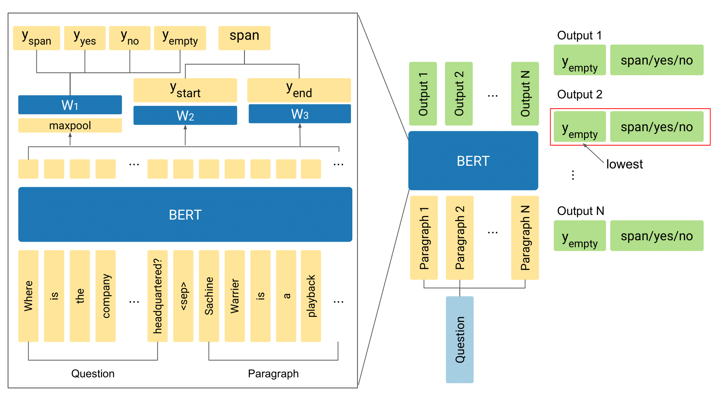

# Single-hop Reading Comprehension Model

This is a general-purpose reading comprehension model based on BERT, which takes a set of paragraphs as an input but is incapable of cross-paragraph reasoning.



This is primarily for [HotpotQA](https://hotpotqa.github.io). However, for any task which input is a question and (one or more) paragraphs and the output is the answer (span from the paragraph/yes/no) to the question, you can use this code.

This code is used in the following paper:

Sewon Min*, Eric Wallace*, Sameer Singh, Matt Gardner, Hannaneh Hajishirzi, Luke Zettlemoyer.
[Compositional Questions Do Not Necessitate Multi-hop Reasoning](https://arxiv.org/pdf/1906.02900.pdf)
In: Proceedings of ACL (short). Florence, Italy. 2019.

```
@inproceedings{ min2019compositional,
    title = { Compositional Questions Do Not Necessitate Multi-hop Reasoning },
    author = { Min, Sewon and Wallace, Eric and Singh, Sameer and Gardner, Matt and Hajishirzi, Hannaneh and Zettlemoyer, Luke },
    booktitle = { ACL },
    year = { 2019 }
}
```

For any question, please contact [Sewon Min](https://shmsw25.github.io) and [Eric Wallace](http://www.ericswallace.com/).

### Acknowledgement
This code is based on a PyTorch version of Google's pretrained BERT model, from an earlier version of [Hugging Face's PyTorch BERT](https://github.com/huggingface/pytorch-pretrained-BERT).

### Requirements
- Python 3.5+
- Pytorch 1.1.0
- Tensorflow  1.3.0 (Just for tokenization)

### Preprocessing

1. Download Pretrained BERT and Convert to PyTorch

There are multiple BERT models: BERT-Base Uncased, BERT-Large Uncased, BERT-Base Cased and BERT-Large Cased. This code is tested on BERT-Base Uncased. Using the larger model may improve results.

First, download the pre-trained BERT Tensorflow models from [Google](https://github.com/google-research/bert#pre-trained-models) into a directory e.g., `bert`.

Next, convert the model to PyTorch:

```
pytorch_pretrained_bert convert_tf_checkpoint_to_pytorch \
  --tf_checkpoint_path bert/bert_model.ckpt \
  --bert_config_file bert/bert_config.json \
  --pytorch_dump_path bert/pytorch_model.bin
```

2. Convert HotpotQA into SQuAD style

To use the same model in all the different datasets, we convert datasets into the SQuAD format. To run on HotpotQA, create a directory and download the [training and validation sets](https://hotpotqa.github.io/) into the directory. Then run:

```
python convert_hotpot2squad.py --data_dir PATH_TO_DATA_DIR --task hotpot-all
```

You can try different task setting using `--task` flag. (Please see the code for the details)

### Training

The main files used for training are:

- `main.py`: main code for training and inference
- `prepro.py`: preprocessing of the data.
- `modeling.py`: actual pytorch model
- `evaluate_qa.py`: to predict the span based on the logits from the model, and compute the F1 score

To train the model,

```
python main.py --do_train --output_dir out/hotpot \
          --train_file PATH_TO_TRAIN_FILE \
          --predict_file PATH_TO_DEV_FILE \
          --init_checkpoint PATH_TO_PRETRAINED_BERT \
          --bert_config_file PATH_TO_BERT_CONFIG_FILE \
          --vocab_file PATH_TO_BERT_VOCAB_FILE
```
Make sure PATH_TO_TRAIN_FILE and PATH_TO_DEV_FILE are set to the output from the convert_hotpot2squad.py script (usually `data/hotpot-all/train.json`). This code will store the best model in `out/hotpot/best-model.pt`.

To make an inference,

```
python main.py --do_predict --output_dir out/hotpot \
        --predict_file PATH_TO_DEV_FILE \
        --init_checkpoint out/hotpot/best-model.pt \
        --predict_batch_size 32 --max_seq_length 300 --prefix dev_
```

This will store `dev_predictions.json` and `dev_nbest_predictions.json` into the `out/hotpot` directory (`prefix` is the prefix of the files to store.).

`PREFIX_predictions.json` is a dictionary with the example id as the keys and the value is the prediction of the model and the ground-truth answer. `PREFIX_nbest_predictions.json` is the same except has the value as the top-k predictions of the model, as well as the logit values, probability values, no-answer value, and the evidence (the paragraph that the answer is from). You can also adjust which values to store in `evaluate_qa.py`.

Other potentially useful flags:
- `--train_batch_size`, `--predict_batch_size`: batch size for training and evaluation.
- `--n_best_size`: number of top k answers to store during inference. (default: 3)
- `--max_answer_length`: maximum length of the answer during inference. (default: 30)
- `--eval_period`: interval to test on the dev data during training. Please adjust this value depending on your `batch_size`. (default: 1000)
- `--debug`: If you want to try on a subset of the data before running the code, to make sure the error does not occur, you can specify this flag.


When you are doing `--do_predict`, if you want to make an inference using an ensemble of models, you can specify several model paths to `--init_checkpoint`: `--init_checkpoint out/hotpot1/best-model.pt,out/hotpot2/best-model.pt`. Then, the code will make an inference of all models and do voting to get the final output.

Similarly, if you want to combine 2+ data for training and inference, you can specify them. e.g., If you want to train SQuAD and HotpotQA jointly, you can add `--train_file SQUAD_TRAIN_FILE,HOTPOT_TRAIN_FILE --predict_file SQUAD_DEV_FILE,HOTPOT_DEV_FILE`, then the code will train and test the model with combined data.
